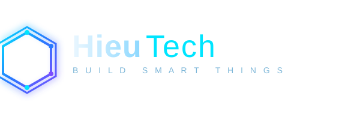

  

Hi, I'm Trinh Minh Hieu 👋
Full-Stack Developer · AI Engineer · Software Architect

I build software that bridges web, mobile, AI, and systems engineering — from scalable backend services and cross-platform applications to intelligent systems powered by modern machine learning models.

I enjoy exploring complex technical challenges, optimizing performance, and turning ideas into reliable, production-ready software.

🛠️ Tech Stack

Languages

  
  
  
  
  
  
  
  
  
  
  
   
   
   
   
   
   
   
   

Engineering Domains

🌐 Web & Backend — Full-stack applications, APIs, distributed services

📱 Mobile Development — Native iOS, Android, cross-platform applications

🎮 Game Development — Game systems, gameplay logic, backend integration

🤖 AI & Machine Learning — Transformers, Diffusers, NLP, computer vision, model optimization

⚙️ Systems Engineering — Native development, performance optimization, low-level programming

☁️ Cloud & Infrastructure — Deployment, automation, scalable services

🔐 Cybersecurity — Application security, reverse engineering, software protection

AI & Machine Learning

🤗 Hugging Face — Transformers & Diffusers

🧬 Deep learning and model experimentation

👁️ Natural language processing and computer vision

🚀 Model deployment, inference optimization, and AI integration

🚀 What I Build

End-to-end web applications and backend platforms

Native and cross-platform mobile applications

AI-powered tools and intelligent automation systems

High-performance software and native components

Scalable infrastructure and developer tooling

Game applications and supporting services

📬 Get in Touch

📧 Email: hieutech@hotmail.com

💻 GitHub: @trinhminhhieu

 <i>Building things, solving problems, and exploring what's possible with technology.</i> 

